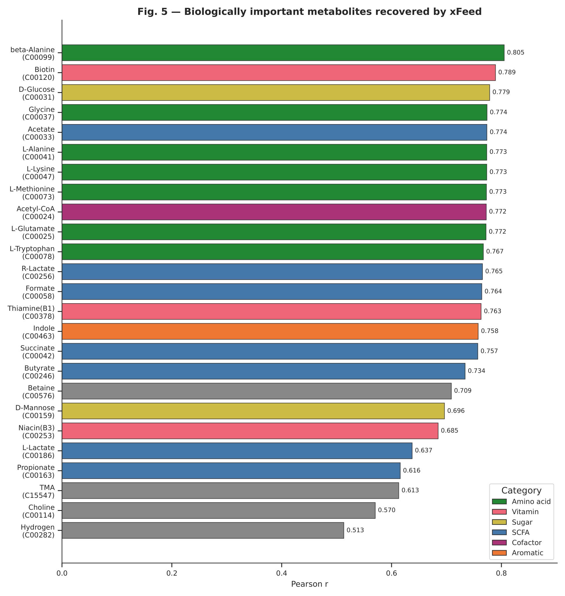
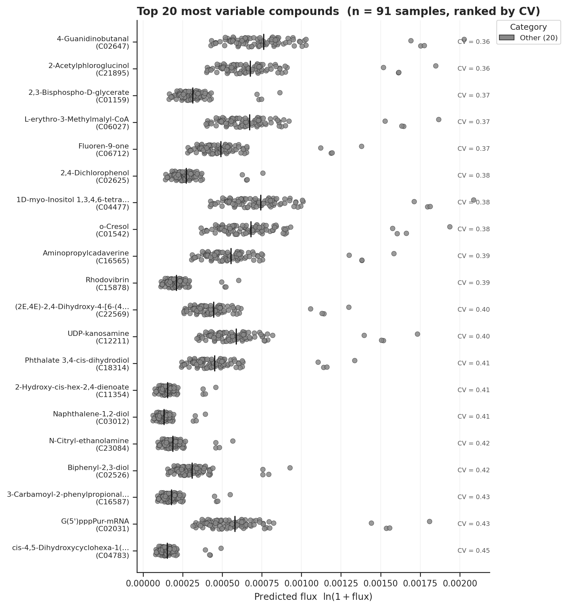
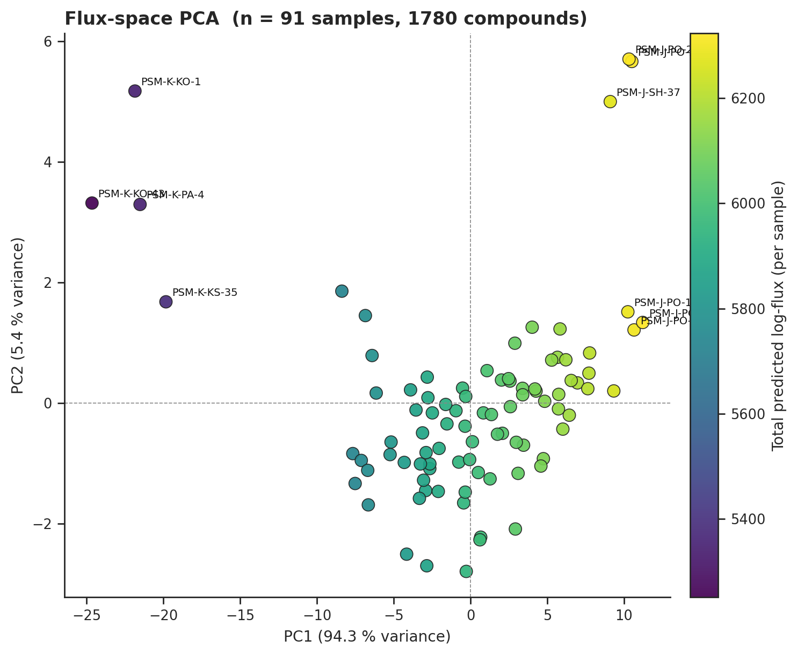
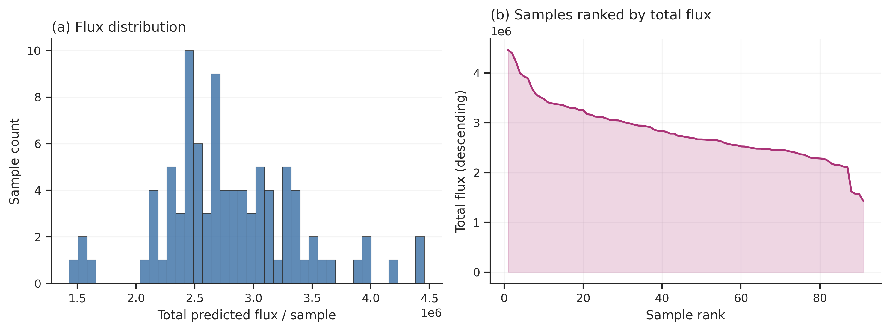
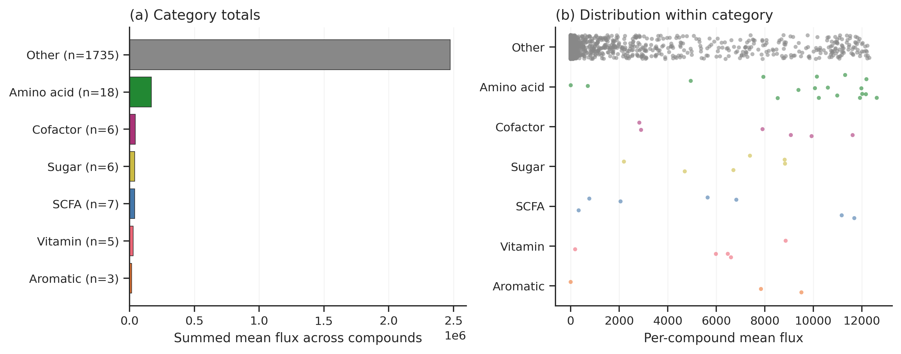
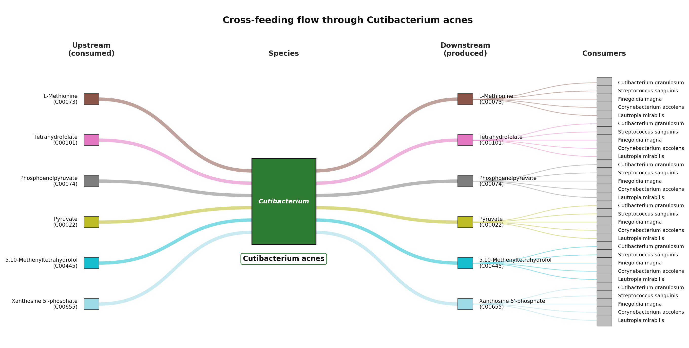
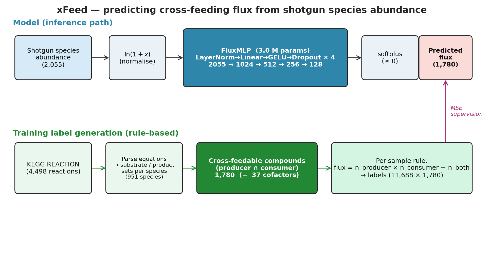

# xFeed

**Predicting microbial cross-feeding flux from shotgun species abundance.**

<p align="center">
  
</p>

<p align="center"><em>
<strong>Performance on the 1,700-sample held-out test set</strong> —
xFeed recovers 25 clinically important metabolites directly from shotgun
species abundance, with Pearson r = 0.51 – 0.81. The three principal
short-chain fatty acids (acetate 0.77, butyrate 0.73, propionate 0.62),
seven amino acids (mean 0.78), three B-vitamins (biotin 0.79), and the
tryptophan → indole gut-brain axis are all learnable without any KEGG
annotations on the input side. Bars are coloured by compound category.
</em></p>

<p align="center">
  
</p>

<p align="center"><em>
<strong>Example output</strong> — each ribbon is one predicted
cross-feeding event: a producer species (left) hands a metabolite
(centre) to a consumer species (right). Ribbon thickness is proportional
to predicted flux and colour identifies the compound. This is exactly
the figure that <code>xfeed predict</code> writes to
<code>images/sankey.png</code> in a single CLI call. Example data:
Lee et al., <em>Microorganisms</em> 2025, <strong>13</strong>, 2491
(<a href="https://doi.org/10.3390/microorganisms13112491">doi</a>).
</em></p>

xFeed is a neural network that predicts per-sample, per-compound
**cross-feeding flux** for **1,780 KEGG cross-feedable compounds** directly
from a standard shotgun species abundance table. The model learns the
species → function → flux mapping from 11,688 training samples and does
not require KEGG module or capability annotations at inference time —
just abundance in, flux out.

## Key features

- **Flux-level output**: 1,780 KEGG cross-feedable compounds covering
  central carbon metabolism, SCFAs, amino acids, B-vitamins, aromatics,
  and more (derived from 4,498 KEGG REACTIONs over 951 annotated species).
- **Abundance-only input**: no KEGG profiles needed at inference time.
  The model implicitly learns the species → function mapping from
  training — it has never seen a KEGG annotation on its input side.
- **Fast**: predicts thousands of samples in a few seconds on a laptop CPU.
- **Biologically accurate**: SCFAs (acetate r = 0.77, butyrate r = 0.73,
  propionate r = 0.62), amino acids (mean r = 0.78 across seven), B-vitamins
  (biotin r = 0.79), and the gut-brain indole axis (r = 0.76).
- **Batteries included**: `xfeed predict` produces a long-format TSV, a
  dense NumPy archive, nine publication-ready figures, per-figure source
  TSVs (so you can re-plot with any tool), and one flow diagram per
  top-K species.

## Installation

### conda (recommended)

```bash
conda install -c chanikyu xfeed
```

### pip

```bash
git clone https://github.com/chanikyu/xfeed.git
cd xfeed
pip install -e .
```

**Requirements**: Python ≥ 3.11, PyTorch ≥ 2.1, numpy, pandas, requests,
tqdm, matplotlib, seaborn, networkx

## Quick start

### Step 1 — Download the profiles + pretrained model (one time)

```bash
xfeed setup
```

Downloads the pre-built cross-feedable compound list, species capability
profiles, and a pretrained FluxMLP checkpoint to `~/.xfeed/`.

### Step 2 — Predict cross-feeding flux

```bash
xfeed predict --abundance your_abundance.tsv
```

Outputs into the same directory as the input:

- `xfeed_predictions.tsv` — long-format table of (sample × compound × flux)
- `xfeed_predictions.npz` — dense (n_samples × 1,780) flux matrix for
  downstream analysis
- `images/` — nine publication-ready figures (see below)
- `data/` — the exact numbers that drive each figure, one TSV per
  figure, so you can re-plot with any tool without re-running inference

### (Optional) Retrain on your own data

```bash
xfeed train --abundance your_abundance.tsv --output-dir xfeed_model/
xfeed predict --abundance new_samples.tsv --checkpoint xfeed_model/xfeed_model.pt
```

## Input format

Species abundance table (TSV or CSV):

|  | Escherichia coli | Bacteroides fragilis | Roseburia intestinalis | ... |
|--|-----------------|---------------------|------------------------|-----|
| sample_1 | 12.5 | 8.3 | 3.1 | ... |
| sample_2 | 0.0 | 15.7 | 6.2 | ... |

- **Rows** = samples, **Columns** = species names
- Values = relative abundance (any scale; log1p is applied internally)
- First column = sample IDs (used as index)
- Supported formats: `.tsv` / `.txt` (tab-separated), `.csv` (comma-separated)

> **Important**: column headers must be **species names**
> (e.g., `Escherichia coli`), not lineage strings
> (e.g., `d__Bacteria;p__Proteobacteria;...;s__Escherichia coli`).
> If your abundance table uses GTDB lineage format, extract the species
> name from the `s__` field before running xFeed.

## Prediction outputs

### `xfeed_predictions.tsv` (long format)

| sample_id | compound | compound_name | flux_log | flux_raw |
|-----------|----------|---------------|---------:|---------:|
| sample_1 | C00033 | Acetate       | 7.12 | 1231.45 |
| sample_1 | C00246 | Butyrate      | 4.58 | 96.62 |
| sample_1 | C00163 | Propionate    | 5.21 | 181.87 |

- `compound`: KEGG Compound ID
- `compound_name`: human-readable name (fetched from KEGG, disk-cached)
- `flux_log`: predicted ln(1 + flow count)
- `flux_raw`: `expm1(flux_log)` back in raw count space

Rows below `--min-flux` (default 1.0) are filtered out so the TSV stays
sparse even though the dense matrix has 1,780 columns.

### `xfeed_predictions.npz` (dense)

NumPy archive with fields:

- `sample_ids` — (n_samples,)
- `compound_list` — (1780,) KEGG compound IDs
- `compound_names` — (1780,) matching human-readable names
- `flux_log` — (n_samples, 1780) float32
- `flux_raw` — (n_samples, 1780) float32

### `images/` — nine visualisation figures

All example images below were generated by running
`xfeed predict --abundance tests/predict_test/abundance.csv` on a
91-sample **human skin microbiome** test cohort from
**Lee et al. (2025), *Microorganisms* 13, 2491**
(DOI: [10.3390/microorganisms13112491](https://doi.org/10.3390/microorganisms13112491)) —
a case study of skin microbiome shifts during Antarctica expeditions.
The abundance table is shipped with the tool as
`tests/predict_test/abundance.csv` under the licence of the original
study. The exact same code path produces your own figures whenever you
run `xfeed predict` on a new abundance table. For each figure we
describe **what it shows** and **how to read it**, so you can take the
output of your run and get a biological conclusion in one minute.

---

#### 1. `variable_compounds` — what differs between samples

<p align="center">
  
</p>

**What it shows.** The top 20 compounds ranked by their **coefficient
of variation (CV) across your samples** — the metabolites whose
predicted flux swings the most from sample to sample. Each row is a
strip plot: one dot per sample, a short black bar at the cohort mean,
and the numeric CV annotated on the right. Rows are coloured by
compound category (SCFA, amino acid, vitamin, sugar, cofactor,
aromatic, other).

**How to read it.** If the dots in a row are tightly clustered around
the mean, that compound is a **community-level constant** — probably
driven by a core metabolic pathway that most samples share. If the
dots are spread across several log-units, that compound is a
**differentiating signal** — the samples disagree, and this compound
is where your cohort's biology becomes interesting. Pick the wide
rows as candidates for downstream statistical testing against disease
labels or treatment groups.

---

#### 2. `flux_pca` — sample embedding

<p align="center">
  
</p>

**What it shows.** A 2-D PCA projection of the full
`(n_samples × 1,780)` predicted log-flux matrix. Each point is a
sample. Points are coloured by **total predicted log-flux** (sum
across all compounds) as a proxy for community-level metabolic
activity. PC1/PC2 axis labels include the explained variance ratio,
and the most extreme samples are labelled.

**How to read it.** Tight clusters indicate samples with similar
metabolic profiles; outliers are communities whose flux signature
looks nothing like the rest. If PC1 explains an unusually large share
of variance (e.g. > 80 %), your cohort is dominated by one metabolic
axis — often total community biomass. Colour gradients along PC1 or
PC2 tell you which axis correlates with the total activity. Needs
≥ 3 samples.

---

#### 3. `flux_density` — per-sample total flux distribution

<p align="center">
  
</p>

**What it shows.** Two panels. (a) A histogram of each sample's total
predicted flux — how many metabolic interactions xFeed predicts the
community is engaged in. (b) The same totals sorted from highest to
lowest, giving a rank curve.

**How to read it.** A narrow unimodal histogram means your cohort
has a consistent baseline of metabolic activity. A long right tail
means a few samples are disproportionately active — worth
investigating whether those are the most diverse or the most
dysbiotic. The rank curve makes it easy to spot batch effects: a
visible step discontinuity often corresponds to a processing or
sequencing batch boundary.

---

#### 4. `compound_composition` — what each sample is doing

<p align="center">
  
</p>

**What it shows.** A stacked bar chart where each column is one
sample and the stack is the top-N compounds by mean predicted flux,
plus an "Other" category for the remaining 1,760+ compounds. Colours
identify compounds; the legend is on the right.

**How to read it.** Compare the stacks side by side. Samples whose
stacks look visually similar have the same metabolic composition.
Samples where one coloured band suddenly shrinks or grows are the
ones you want to dig into — they mark metabolite-specific divergence.
"Other" taking the bulk of the bar means your cohort's flux is
distributed across many rare compounds rather than a few dominant
ones.

---

#### 5. `compound_categories` — functional group totals

<p align="center">
  
</p>

**What it shows.** Two panels. (a) Total summed flux per curated
category (SCFA, amino acid, vitamin, sugar, cofactor, aromatic,
other), with compound counts in parentheses. (b) A strip plot of the
per-compound mean flux values inside each category so you can see the
internal spread.

**How to read it.** The left panel is a one-glance answer to "what
is this community mostly busy doing?" If SCFA dominates, this is a
fermenter-heavy community; if amino acid exchange dominates, it is a
nitrogen-sharing network. The right panel reveals heterogeneity:
tight strips mean every compound in that category has similar
activity, while spread-out strips mean a few outlier compounds carry
the whole category.

---

#### 6. `heatmap` — species × species interaction density

<p align="center">
  
</p>

**What it shows.** A top-20 species × top-20 species matrix of
interaction counts. Cell `(i, j)` is the number of distinct compounds
that species `i` and species `j` can exchange in either direction
(producer → consumer), computed from the KEGG-derived capability
profile. Warmer colours (YlOrRd) mean more potential exchange.

**How to read it.** Look for **dark red clusters** off the diagonal —
those are pairs of species that could exchange dozens to hundreds of
metabolites and are prime candidates for mutualistic or
commensal pairs. A uniformly hot row means one "hub" species that
interacts with everyone (keystone candidate). Blocks of cool yellow
identify species that are metabolically isolated within this cohort.
The heatmap is structural (driven by `species_caps`), so it tells you
what interactions are *possible* in this community; combine it with
`sankey` or the per-species flux diagrams to see which ones xFeed
predicts are *active*.

---

#### 7. `compound_distribution` — most exchanged metabolites

<p align="center">
  
</p>

**What it shows.** The top-15 compounds ranked by the number of
producer-consumer species pairs capable of exchanging them in your
cohort. The x-axis is the raw pair count
(`|producers| × |consumers|`), and the numeric count is annotated at
each bar end.

**How to read it.** Compounds at the top of this list are the ones
your cohort has the **greatest theoretical flux bandwidth** for —
many species could send and many species could receive. These are
the metabolites most likely to be robust to perturbation because
multiple species can substitute for each other. Compounds at the
bottom of a long tail indicate narrow, fragile exchange pathways
that would collapse if a single species were lost.

---

#### 8. `crossfeeding_degree` — who is the most central

<p align="center">
  
</p>

**What it shows.** The top-20 species in your cohort ranked by their
**total cross-feeding degree** — the sum of all producer and consumer
pair-matches across all compounds they handle. Bars are coloured by
each species' **top compound**, and a legend on the right names those
top compounds.

**How to read it.** The top bars are your **keystone candidates** —
species whose removal would disconnect the network in many places.
If several top species share the same top compound colour, that
compound is the main backbone of community exchange. Species whose
top compound is rare (only one colour in the legend) are niche
specialists. Use this figure alongside `heatmap` to identify the few
species that deserve a dedicated per-species flux diagram (see #10).

---

#### 9. `sankey` — producer → compound → consumer flow

<p align="center">
  
</p>

**What it shows.** A three-column Sankey: left column is the top
producer species, centre column is the top compounds by predicted
flux, right column is the top consumer species. Ribbon thickness is
proportional to predicted flux; ribbon colour identifies the
compound.

**How to read it.** Follow a ribbon from a producer species, through
a compound block, to a consumer species — that is a single predicted
cross-feeding event. **Thick ribbons = high-volume exchanges**,
typically SCFAs or amino acids. A species appearing on BOTH the left
and right columns for the same compound is one that both produces
and consumes that metabolite (internal-pool members). Compounds
drawing ribbons from many producers and feeding many consumers are
the "currency" of the community — losing any single species does not
break that flow, while compounds with single-producer or
single-consumer traffic are fragile choke points.

---

#### 10. `flux/{species}.png` — per-species cross-feeding flow

<p align="center">
  
</p>

**What it shows.** A four-column flow diagram centred on ONE species
(here, `Cutibacterium acnes`). From left to right: upstream compounds
this species **consumes**, the species itself, downstream compounds
it **produces**, and the other species in the cohort that would
**consume** those products. Ribbon thickness on the left and middle
columns is proportional to predicted flux; the right column is
ranked by consumer abundance.

**How to read it.** This figure answers "what metabolic role does
this one species play in this specific community?" The left column
tells you what environmental substrates it depends on; the middle
column shows its output; the right column shows the species that
benefit downstream. If the left column is dense and the right column
is sparse, the species is an upstream scavenger (net sink). If the
left column is sparse and the right column is dense, it is a
producer / keystone feeder. Use this for the top 10 most abundant
species in your cohort — one PNG is written per species into
`images/flux/`, named after the species.

---

### `data/` — per-figure source TSVs

Every figure above has a matching TSV under `data/`, so you can
re-plot the same numbers in any tool (R/ggplot, Observable,
Prism, …) without re-running inference.

### `data/` — per-figure source TSVs

Every figure has a matching TSV under `data/`, so you can re-plot the
same numbers in any tool without re-running inference.

| File | Content |
|------|---------|
| `data/compound_ranking.tsv` | Master table of all 1,780 compounds: name, category, mean flux (log & raw), std, coefficient of variation. |
| `data/variable_compounds.tsv` | Top-20 CV-ranked compounds with one `log_{sample_id}` column per sample — the exact values plotted in the strip figure. |
| `data/flux_pca_scores.tsv` | Per-sample PC1–PC5 scores and total log-flux. |
| `data/flux_pca_variance.tsv` | Explained variance ratio for each of the top 5 principal components. |
| `data/flux_density.tsv` | Per-sample total flux (raw & log), mean flux, number of non-zero compounds. |
| `data/compound_composition.tsv` | Top-20 × samples long-format (sample, compound, name, flux_raw, flux_log). |
| `data/compound_categories.tsv` | Per-category aggregated totals and means. |
| `data/heatmap_interaction_counts.tsv` | Top-20 × top-20 symmetric species-pair interaction matrix. |
| `data/compound_distribution.tsv` | Per-compound producer × consumer counts across the present species pool. |
| `data/crossfeeding_degree.tsv` | Per-species total cross-feeding degree and top compound. |
| `data/sankey_edges.tsv` | Long-format (compound, producer, consumer, flux_weight) edges for the Sankey figure. |
| `data/flux/{species}.tsv` | Four-direction flow for one species: `direction ∈ {consumed, produced, downstream_consumer}`, compound, partner, weight. |

## Commands

### `xfeed setup`

| Argument | Default | Description |
|----------|---------|-------------|
| `--output-dir` | `~/.xfeed` | Where to save profiles and model |

### `xfeed predict`

| Argument | Default | Description |
|----------|---------|-------------|
| `--abundance` | required | Species abundance table (TSV / CSV) |
| `--checkpoint` | `~/.xfeed/xfeed_model.pt` | Path to the FluxMLP checkpoint |
| `--profile-dir` | `~/.xfeed` | Profile directory from `xfeed setup` (needed for the `heatmap`, `compound_distribution`, `crossfeeding_degree`, `sankey`, and per-species flux figures) |
| `--output` | `xfeed_predictions.tsv` | Long-format TSV output (the dense `.npz`, `images/` and `data/` use the same stem) |
| `--min-flux` | `1.0` | Minimum raw flux to include in the long-format TSV |
| `--top-n` | `20` | Number of top compounds to use in the rank-based figures |
| `--no-visualize` | off | Skip figure / data TSV generation |
| `--image-format` | `png` | `png` (raster, good for web/slides) or `pdf` (vector, good for manuscripts). All figures in a run use the chosen format. |
| `--flux-top-species` | `10` | Number of most-abundant species to draw per-species flux diagrams for, in `images/flux/`. Set to `0` to skip. |
| `--device` | `auto` | `auto` / `cpu` / `cuda` / `mps` |

### `xfeed train`

| Argument | Default | Description |
|----------|---------|-------------|
| `--abundance` | required | Species abundance table (TSV / CSV) |
| `--profile-dir` | `~/.xfeed` | Profile directory from `xfeed setup` |
| `--output-dir` | `xfeed_model` | Checkpoint and training history output |
| `--epochs` | 40 | Maximum training epochs (early stop with patience) |
| `--lr` | 1e-3 | AdamW learning rate with cosine annealing |
| `--batch-size` | 128 | Mini-batch size |
| `--patience` | 10 | Early-stop patience |
| `--device` | `auto` | `auto` / `cpu` / `cuda` / `mps` |

## Architecture

<p align="center">
  
</p>

- **Input**: log1p species abundance, `(2,055,)`
- **Encoder**: stacked `LayerNorm → Linear → GELU → Dropout` blocks,
  `2055 → 1024 → 512 → 256 → 128`
- **Head**: `Linear(128, 1780)` → `softplus` to keep flux non-negative
- **Parameters**: ~3.0 M
- **Loss**: MSE on ln(1 + flow count)
- **No KEGG modules or capability annotations on the input side**

## How it works

1. **KEGG REACTION backbone** — every reaction catalysed by a KO in a
   species' KEGG genome annotation is parsed into substrate / product
   compound sets. 4,498 reactions × 951 species.
2. **Cross-feedable compounds** — 1,780 compounds that are produced by
   at least one species and consumed by at least one other, excluding
   37 ubiquitous cofactors (H₂O, ATP, NAD⁺, CoA, …).
3. **Rule-based labels** — for each training sample, the flux for a
   compound equals (# producer species active) × (# consumer species
   active) − (# species that do both). These are the targets FluxMLP
   learns to predict from abundance alone.
4. **FluxMLP** — a 3.0 M-parameter feed-forward network learns the
   1,780-dim flux vector from the 2,055-dim log1p species abundance
   vector, without any KEGG feature engineering on the input side.

## Performance

Trained on 8,186 samples from the curatedMetagenomicData collection
(subject-level split across 84 studies) and evaluated on a held-out
test set of 1,700 samples:

| Metric | Value |
|--------|------:|
| Mean per-compound Pearson r | **0.484** |
| Median per-compound Pearson r | **0.618** |
| Predictable compounds (non-zero test variance) | 1,373 / 1,780 |
| Compounds with Pearson > 0.5 | 832 / 1,373 (60.6 %) |
| Compounds with Pearson > 0.7 | 516 / 1,373 (37.6 %) |
| Log-MSE vs. mean baseline | **−17.3 %** |
| Mean Pearson vs. nearest-neighbour baseline | **+63.9 %** |
| Mean Spearman vs. nearest-neighbour baseline | **+79.9 %** |

Biologically important metabolites (test-set Pearson r):

| Compound | Pearson r |
|----------|----------:|
| β-Alanine | 0.81 |
| Biotin (B7) | 0.79 |
| D-Glucose | 0.78 |
| L-Glutamate | 0.77 |
| **Acetate** | **0.77** |
| L-Tryptophan | 0.77 |
| Indole | 0.76 |
| Thiamine (B1) | 0.76 |
| **Butyrate** | **0.73** |
| **Propionate** | **0.62** |

All three principal short-chain fatty acids — acetate, butyrate,
propionate — plus seven amino acids (mean Pearson r = 0.78), three
B-vitamins (mean r = 0.75), and the tryptophan → indole gut-brain axis
are all directly recovered from shotgun species abundance alone.

Full per-compound metrics for all 1,780 KEGG compounds are shipped
with the companion manuscript as a supplementary table.

## Citation

If you use xFeed in your research, please cite:

> xFeed: predicting microbial cross-feeding flux from shotgun species abundance

### Example data attribution

The 91-sample abundance table shipped as
`tests/predict_test/abundance.csv` — and all example figures generated
from it in `examples/` — come from a published human skin microbiome
case study. If you reuse those files, please also cite:

> Lee, K.-C.; Lee, H.; Kim, O.-S.; Sul, W.J.; Lee, H.; Kim, H.-J.
> *Case Study on Shifts in Human Skin Microbiome During Antarctica
> Expeditions.* **Microorganisms** 2025, **13**, 2491.
> https://doi.org/10.3390/microorganisms13112491

## License

GPL-3.0 (academic / non-commercial) | commercial license available on request.
