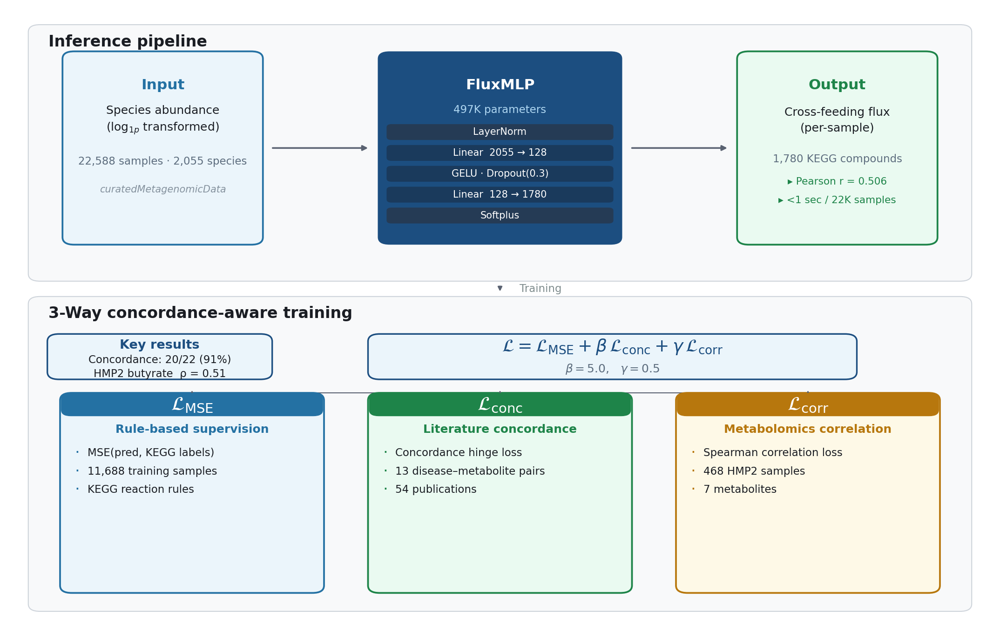
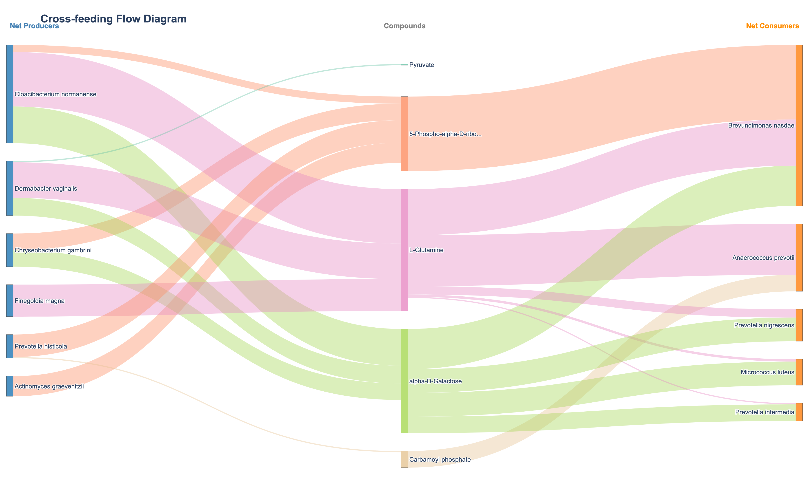
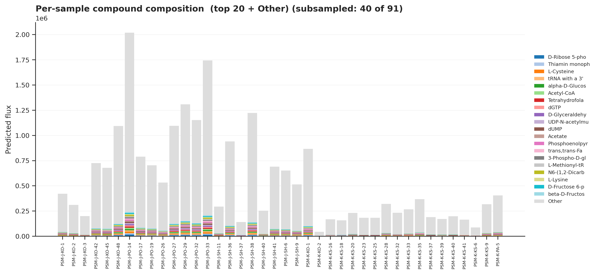
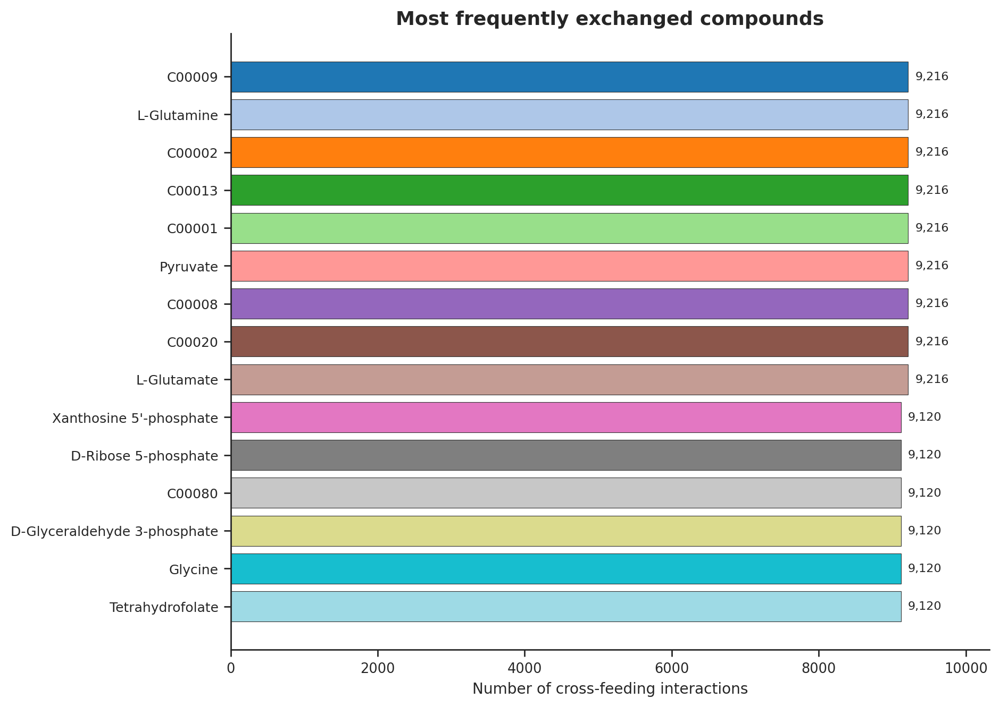
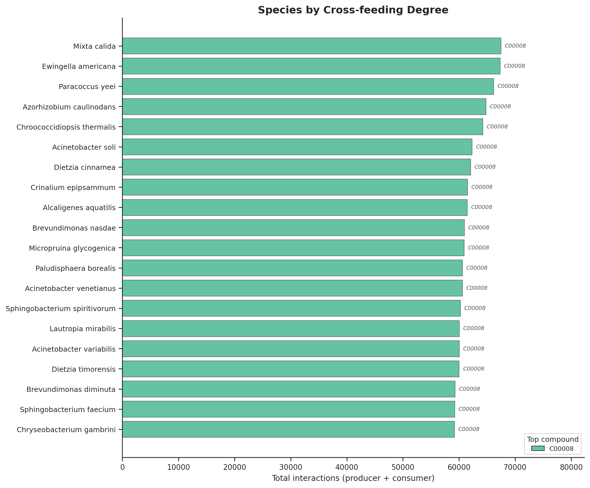
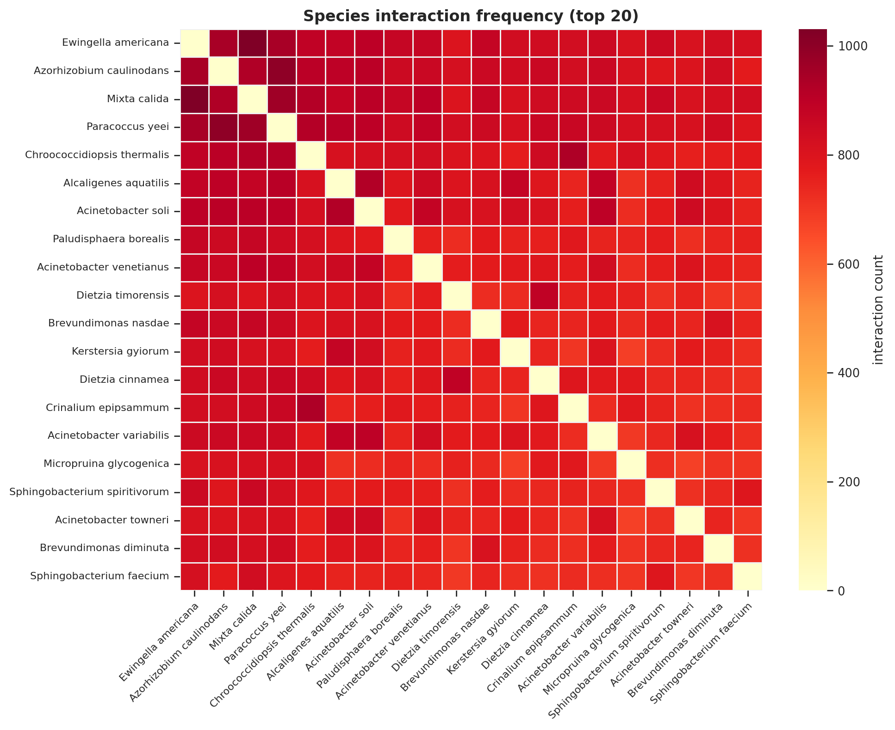

# xFeed

**Predicting microbial cross-feeding flux from shotgun species abundance.**

<p align="center">
  
</p>

xFeed predicts **per-sample, per-compound cross-feeding flux** for
**1,780 KEGG compounds** directly from a species abundance table.
No KEGG annotations needed at inference — just abundance in, flux out.

## Installation

```bash
# conda (recommended)
conda install -c chanikyu xfeed

# or pip
git clone https://github.com/chanikyu/xfeed.git
cd xfeed && pip install -e .
```

**Requirements**: Python ≥ 3.11, PyTorch ≥ 2.1, numpy, pandas, matplotlib, seaborn

## Quick start

```bash
xfeed setup                                  # download model + profiles (one time)
xfeed predict --abundance your_abundance.tsv  # predict cross-feeding flux
```

**Input**: species abundance table (TSV/CSV) — rows = samples, columns = species names.

**Output**:
- `xfeed_predictions.tsv` — long-format (sample × compound × flux)
- `xfeed_predictions.npz` — dense matrix for downstream analysis
- `images/` — publication-ready figures
- `data/` — per-figure source TSVs

## Output figures — how to read them

All examples below were generated from a 91-sample human skin microbiome
cohort (Lee et al., *Microorganisms* 2025).

---

### `sankey.png` — Cross-feeding flow diagram

<p align="center">
  
</p>

Three columns: **producer species** (left) → **compound** (centre) → **consumer species** (right).

- **Ribbon thickness** = predicted flux × species abundance. Thicker ribbons mean more active cross-feeding.
- **Ribbon colour** = compound identity.
- **Species appearing on both sides** for the same compound = both produces and consumes it.
- Look for **thick ribbons** to identify the dominant metabolic exchanges in your community.

---

### `compound_composition.png` — Per-sample metabolic profile

<p align="center">
  
</p>

Stacked bar chart where each column is one sample, each colour is a compound.

- Samples with **similar colour stacks** have similar metabolic composition.
- A colour band that **suddenly shrinks or grows** between samples marks a compound-specific shift worth investigating.

---

### `compound_distribution.png` — Most exchanged metabolites

<p align="center">
  
</p>

Compounds ranked by the number of producer–consumer species pairs that can exchange them.

- **Top compounds** = highest theoretical flux bandwidth. Many species can substitute for each other → robust to perturbation.
- **Bottom compounds** = narrow exchange pathways that collapse if a single species is lost.

---

### `crossfeeding_degree.png` — Keystone species

<p align="center">
  
</p>

Species ranked by total cross-feeding degree (sum of all producer + consumer pair-matches).

- **Top bars** = keystone candidates whose removal would disconnect the network.
- Bar colour = each species' top compound.

---

### `heatmap.png` — Species interaction density

<p align="center">
  
</p>

Species × species matrix showing how many distinct compounds each pair can exchange.

- **Dark red clusters** = species pairs that could exchange dozens of metabolites (mutualistic candidates).
- **Cool yellow** = metabolically isolated species.

---

## Performance

| Metric | Value |
|--------|------:|
| Literature concordance | **20/22 (91%)** — 13 diseases, 40 publications |
| HMP2 butyrate Spearman ρ | **0.51** |
| Mean Pearson r (1,373 compounds) | **0.506** |
| Inference (22,588 samples) | **1.3 sec** |

## Citation

> xFeed: predicting microbial cross-feeding flux from shotgun species abundance

Example data: Lee et al. (2025), *Microorganisms* 13, 2491
([doi](https://doi.org/10.3390/microorganisms13112491)).

## License

GPL-3.0 (academic / non-commercial) | commercial license available on request.
